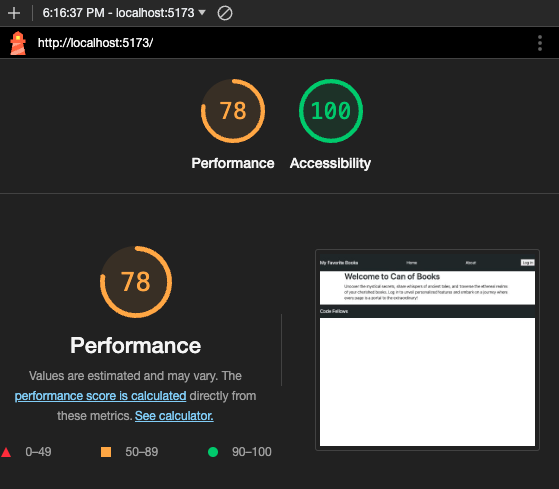

# Can-of-Books

**Author**: Drew Stroede
**Version**: 1.0.0

## Overview

This application showcases a curated selection of my preferred literary works while highlighting my proficiency in utilizing MongoDB, React, JavaScript, and Bootstrap.

## Getting Started

## Architecture

As stated previously, this app features MongoDB, React, Javascript, Bootstrap, and Vite.

## Lighthouse

## Change Log

Started Dec 2, 2023
Finished with add and delete buttons Dec 13, 2023

## Credit and Collaborations

Credit to Code Fellows

## Name of feature: App creation

Estimate of time needed to complete: 2 0min

Start time: 2:45pm

Finish time: 3:15pm

Actual time needed to complete: 30 min

## Name of feature: Adding Carosouel

Estimate of time needed to complete: 1hr

Start time: 4:05pm

Finish time: 4:35pm

Actual time needed to complete: 30 min

## Name of feature: Set Route

Estimate of time needed to complete: 45 min

Start time: 8:30am

Finish time: 8:45am

Actual time needed to complete: 15 min

## Name of feature: Adding About Me

Estimate of time needed to complete: 20 min

Start time: 11:30pm

Finish time: 12:45pm

Actual time needed to complete: 1 hr 15 min

## Name of feature: Adding Books

Estimate of time needed to complete: 1hr

Start time: 9am

Finish time: 11:35am

Actual time needed to complete: 2hrs 35min

## Name of feature: Deleting Books

Estimate of time needed to complete: 45 min

Start time: 3:30pm

Finish time: 4:50pm

Actual time needed to complete: 15 min

## Name of feature: Updating Books

Estimate of time needed to complete: 40 min

Start time: 6:15pm

Finish time: 8:30pm

Actual time needed to complete: 2 hrs 15 min.